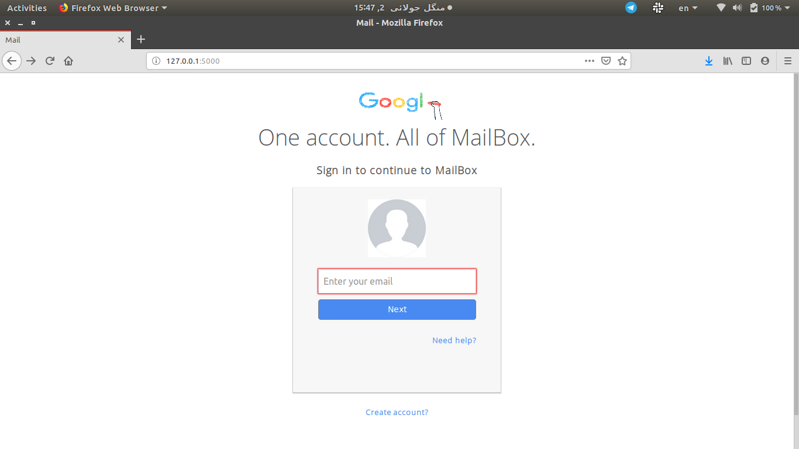
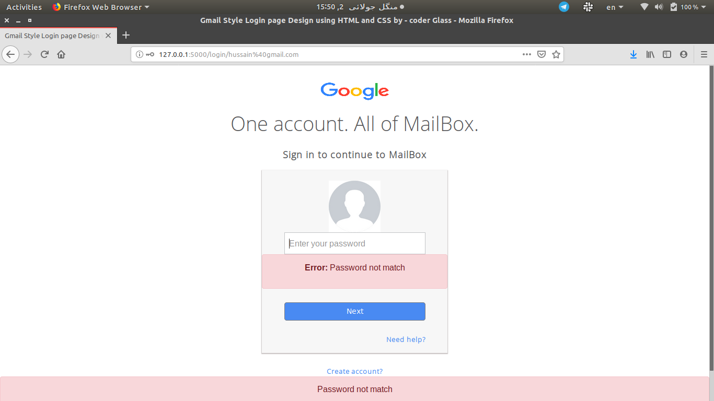
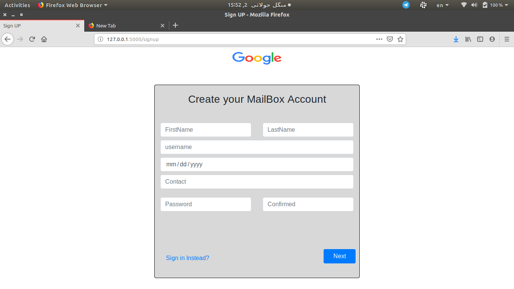
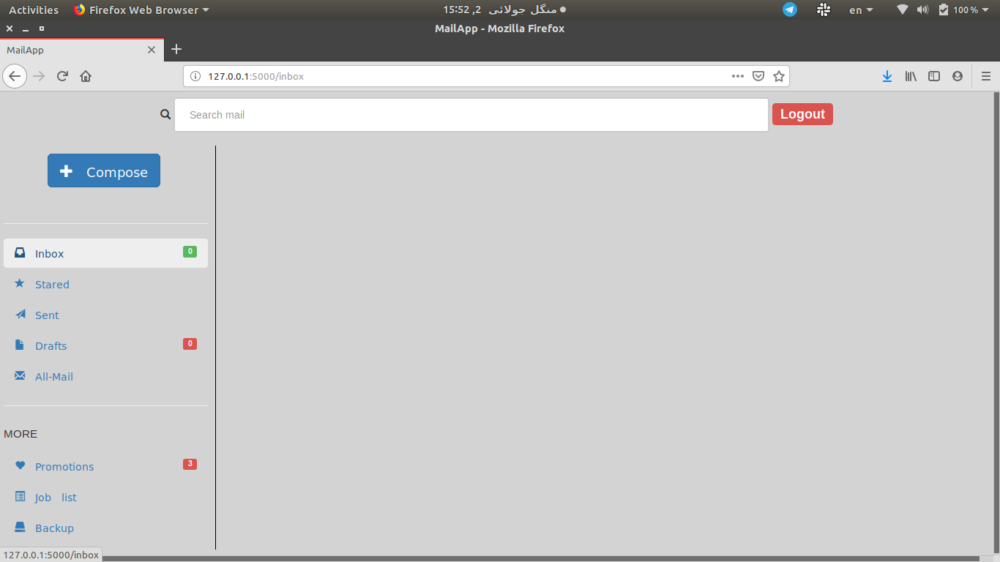
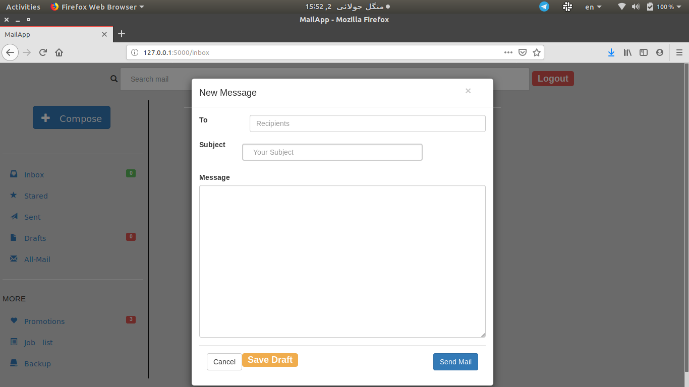
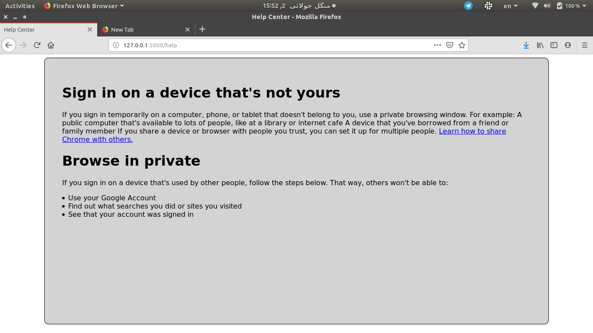

#   Mail Box
Database Project
To solve pip problem
* sudo python3 -m pip uninstall pip && sudo apt install python3-pip --reinstall

Flask is the web frame work of the python.
Two frame work of python one is django which is advanced and other is flask which is very easy to understand.
The technologies wich we used in our project are as follows.
* SQLAlchemy to interact with database
* Flask-Marshmallow
* Postman to check

Install package to make environment:
* pip3 install pipenv

TO activate enviroment:
* pipenv shell

install packagestouch 
* pipenv install flask flask-sqlalchemy flask-marshmallow marshmallow-sqlalchemy

##   Project Screenshots
- - - -

- - - -

- - - -

- - - -

- - - -

- - - -

